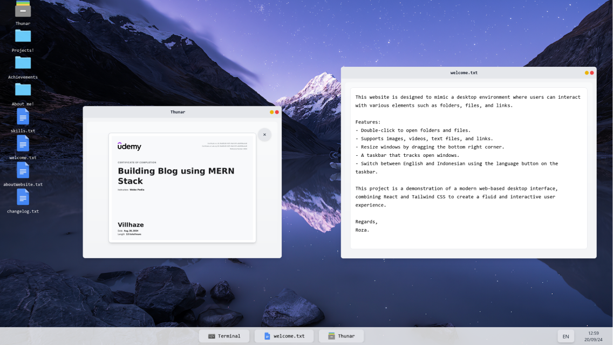

# Windows Portfolio - Interactive Desktop Environment



Windows Portfolio is a modern, interactive web application that simulates a Windows desktop environment, built with React.js. It serves as both a portfolio showcase and a functional desktop experience in your browser.

## Key Features

- 🖥️ **Fully Functional Desktop Environment**
  - Interactive desktop with icons and windows
  - File explorer with folder navigation
  - Terminal emulator with command execution

- 🎵 **Integrated Spotify Player**
  - Control Spotify playback directly from the desktop
  - Seamless integration with Spotify Web API

- 🌐 **Multi-language Support**
  - Built-in support for multiple languages
  - Easy language switching functionality

## Technology Stack

- **Frontend**: React.js, Tailwind CSS
- **State Management**: React Hooks
- **API Integration**: Spotify Web API

## Installation

1. Clone the repository:
   ```bash
   git clone https://github.com/yourusername/windows-portfolio.git
   ```

2. Install dependencies:
   ```bash
   npm install
   ```

3. Start the development server:
   ```bash
   npm start
   ```

4. Open your browser and navigate to `http://localhost:3000`

## Usage

- **Desktop Icons**: Double-click to open applications or files
- **Taskbar**: Access running applications and system controls
- **File Explorer**: Navigate through the virtual file system
- **Terminal**: Execute commands in the emulated terminal
- **Spotify Player**: Control music playback from the desktop
